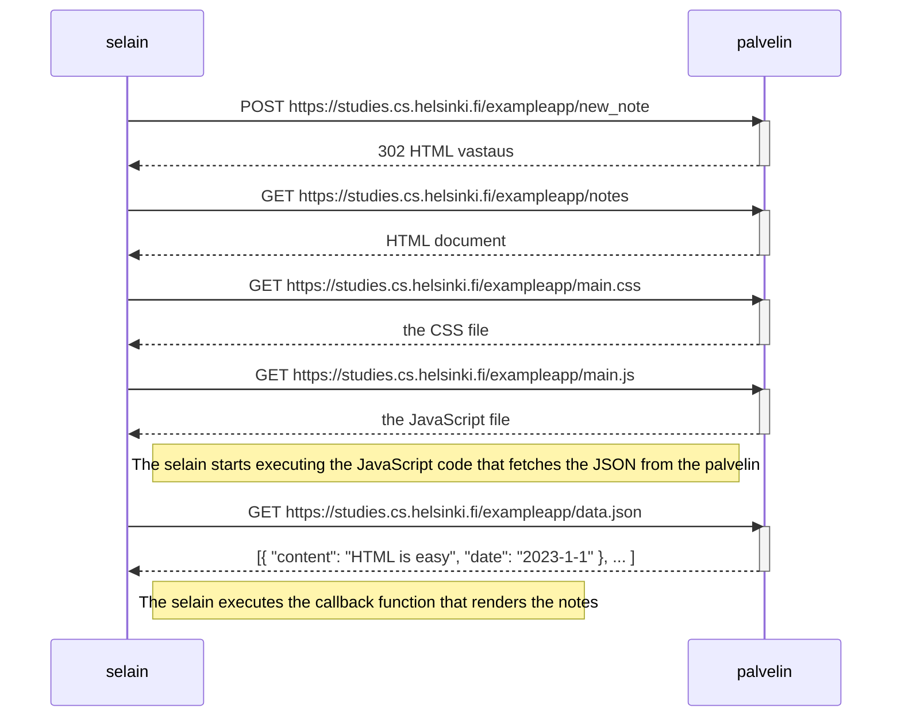

Aleksi Kanerva

# 0.4 muistiinpano

Pohjana käytetty kurssilla tarjoama mermaid-sekvenssikaavio.

Uuden muistiinpanon tehdessä selain lähettää ensin POST-kutsun osoitteeseen .../exampleapp/new_note. Kutsun runko sisältää syöttökentän sisällön noottina; palvelin lisää nootin listalle, ja lisää siihen päivämäärän (joka ei käyttäjälle näy).

Kutsun onnistuessa palvelin vastaa 302 vastauksella, joka kehottaa palvelimen tekemään uuden GET-kutsun vastauksen "location"-parametrin osoitteeseen /exampleapp/notes. GET-kutsulla saa päivitetyn html-dokumentin, joka kehottaa lataamaan myös CSS-tiedoston (tyylitys), JavaScript-tiedoston (scriptilogiikka) ja JSON-tiedoston (nootit).

Käytännössä uuden nootin lisääminen lähettää nootin tiedot, ja lataa sivun uudelleen samalla tavalla kuin se ladattaisiin muutenkin.
