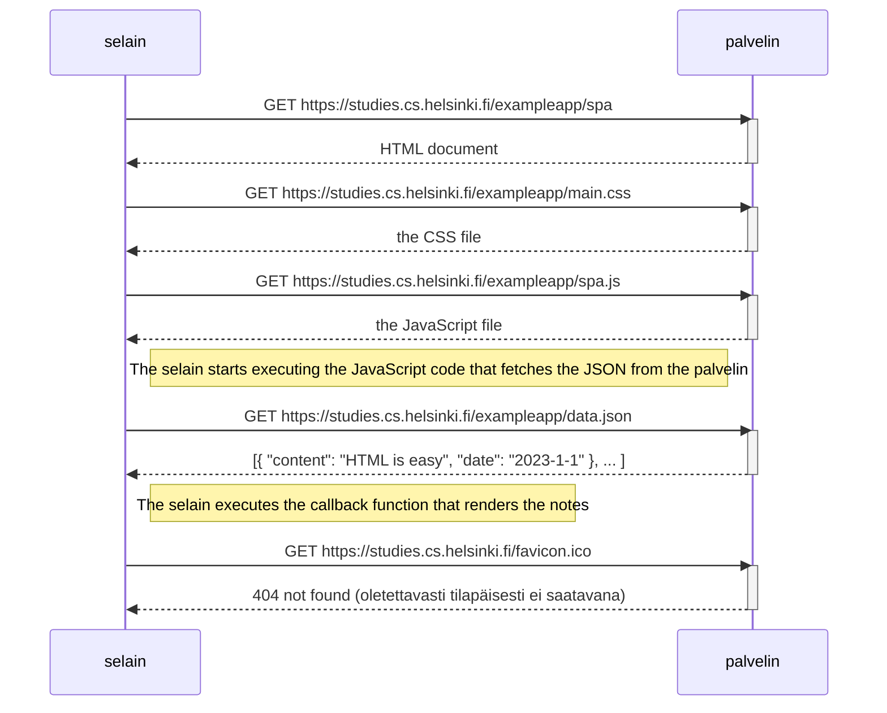
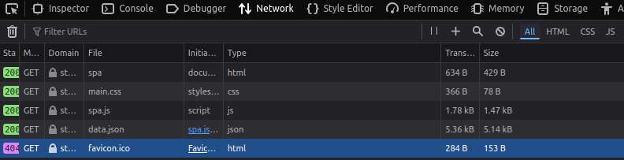
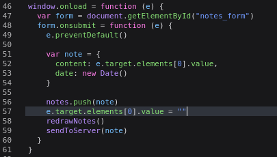

Aleksi Kanerva

# 0.5 Single Page App

Tässä tapauksessa spa toimii sinänsä samalla tavalla kuin niin sanotusti perinteinen sivusto.

Alla kuva tehdyistä kutsuista kun sivu ladataan. Näyttää siis samalta kuin aiemmassakin tehtävässä.

Ainoana erona on lisäys JavaScript-tiedostoon, jossa on jo valmiina logiikka muistiinpanon lähettämiseen ja sen käsittelemiseen. SPA tietää jo valmiiksi kuinka onnistuneesti lähetetty muistiinpano lisätään jo kerran ladattuun näkymään. Logiikkaa on siis hitusen siirretty html:stä formin kohdalla JavaScript-tiedostoon. Alla kuva koodinpätkästä joka käsittelee formin sisällön, eli muistiinpanon lähetyksen.

Tästä herääkin kysymys, että mitä jos palvelin ei hyväksy syystä tai toisesta muistiinpanoa -- päivittyykö muistiinpano kuitenkin omaan näkymään, sillä redrawNotes()-funktiota ei suoriteta ainoastaan 201-vastauksen jälkeen?
