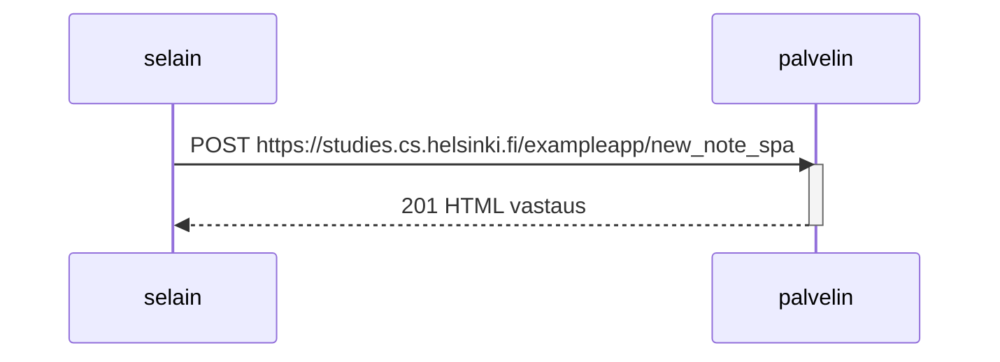
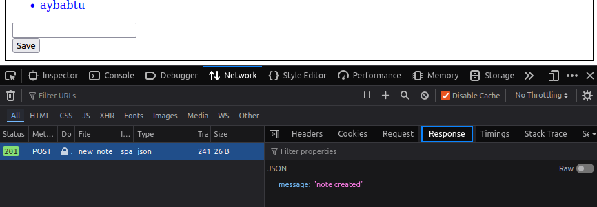

Aleksi Kanerva

# 0.6 Uusi muistiinpano (SPA)

Selain lähettää POST-pyynnön rungossa muistiinpanon sisällön. Vastaus 201 ilmoittaa, että muistiinpano on hyväksytty ja luotu. Tämä riittää selaimelle lisäämään oman muistiinpanon jo ladattujen JSONin muistiinpanojen lisäksi.

Periaatteessa ladattujen muistiinpanojen ja oman itse lisäämän muistiinpanojen väliin voi oikeasti kuulua muiden käyttäjien lisäämiä muistiinpanoja, mutta ne eivät näy sivulla ennen uudelleen päivittämistä. Oma muistiinpano lisätään listan hännille _lokaalisti_, eli lista ei kokonaisuudessaan välttämättä reflektoi palvelimen listaa. Tätä ei kysytty, mutta jännä juttu omasta mielestä.

Vastaus tosiaan vain ilmoittaa onnistumisesta.
